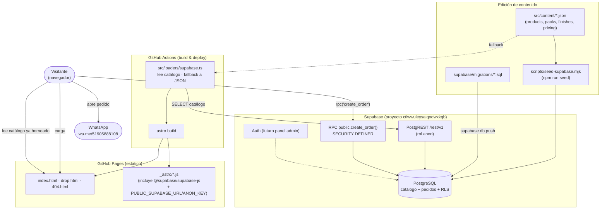
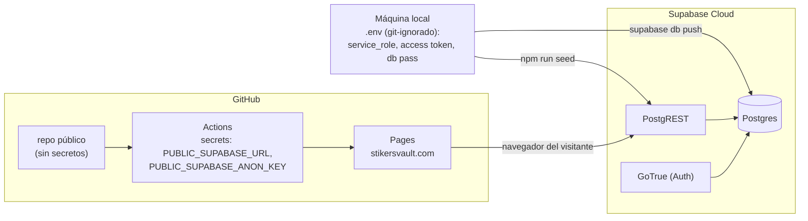
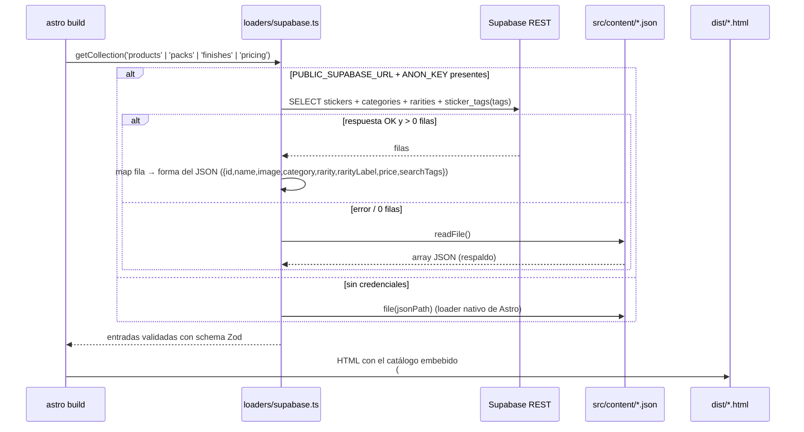
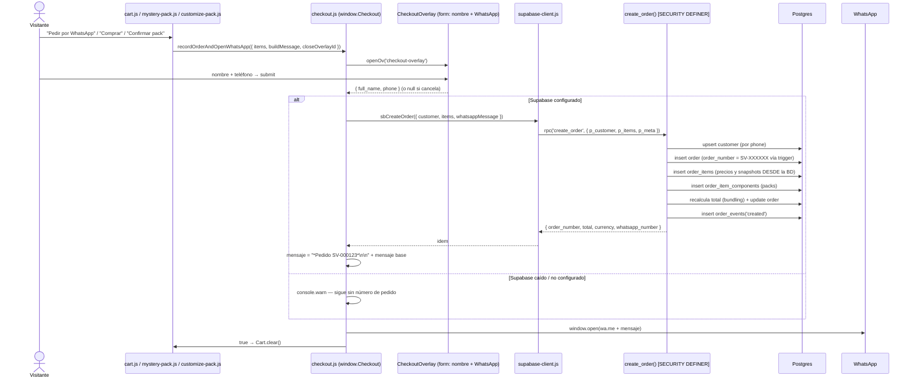

# Arquitectura — Sticker Vault

> Documento interno. No se publica. Estado: 2026-09-05, rama `astro-migration`.

## 1. Resumen en una frase

Sitio **estático** (Astro → HTML/JS/CSS en GitHub Pages) que consume un
backend **Supabase** de dos formas: el **catálogo** se hornea en tiempo de
build, y los **pedidos** se registran desde el navegador a través de una
única función RPC antes de derivar la venta a WhatsApp.

## 2. Principios de diseño

| Principio | Cómo se aplica |
|---|---|
| **El sitio sigue siendo estático** | No hay servidor propio ni SSR. Todo lo dinámico lo resuelve el navegador contra Supabase o se resuelve en build. |
| **La `anon key` es pública** | Va en el bundle. La seguridad NO depende de ocultarla, depende de RLS + una RPC `SECURITY DEFINER`. |
| **El JSON es la fuente editable + el respaldo** | `src/content/*.json` se sigue versionando. Si Supabase no está configurado o no responde, el build usa el JSON. |
| **El servidor manda en el precio** | `create_order()` recalcula el total desde `stickers` / `store_config`. El navegador no puede falsear importes. |
| **La venta nunca se bloquea** | Si el registro del pedido falla, igual se abre WhatsApp (sin número de pedido). |
| **Snapshots en los pedidos** | Cada línea de pedido guarda nombre/precio/imagen del momento. Cambiar el catálogo no altera pedidos históricos. |

## 3. Diagrama de componentes



## 4. Diagrama de despliegue



## 5. Flujo A — Lectura del catálogo (build time)



**Consecuencia operativa:** cambiar datos en Supabase **no** se ve en
producción hasta el siguiente deploy. Para refrescar: `npm run seed` (si
editaste el JSON) y luego push / *Run workflow*.

## 6. Flujo B — Registro de un pedido (runtime)



## 7. Stack

| Capa | Tecnología |
|---|---|
| Front | Astro 7 (`build.format:'file'`, sin adapter), Tailwind 4, JS vanilla (módulos ES bundleados) |
| Contenido | Astro Content Layer (`defineCollection` + Zod), loaders propios |
| Backend | Supabase: PostgreSQL 15+, PostgREST, GoTrue |
| Cliente DB | `@supabase/supabase-js` v2 (build-time y browser) |
| Infra | GitHub Pages + GitHub Actions; dominio propio `stikersvault.com` |
| Analítica | Plausible (sin cookies) |
| Pago | Manual por WhatsApp (`wa.me/51905888108`) |

## 8. Estructura de carpetas relevante

```
src/
  content.config.ts        colecciones (schema Zod) — loader = Supabase|JSON
  content/*.json           catálogo editable a mano + respaldo de build
  loaders/supabase.ts      loader de catálogo con fallback
  scripts/
    shared.js              WA, openOv/closeOv, showToast, SPRITES (globales)
    supabase-client.js     createClient(anon) + sbCreateOrder()
    checkout.js            window.Checkout: form nombre+tel + registro + WhatsApp
    cart.js                carrito (localStorage sv_cart_v2, guarda slug)
    catalog.js             grid/búsqueda del home + vista rápida (openSticker)
    mystery-pack.js        Pack Sorpresa  → kind 'pack_sorpresa'
    customize-pack.js      Pack Personalizado → kind 'pack_personalizado'
  components/
    CheckoutOverlay.astro  modal nombre + WhatsApp (común a los 3 flujos)
    StickerOverlay.astro   vista rápida de un sticker (la llena catalog.js)
  layouts/BaseLayout.astro carga: analytics → shared → checkout → cart
scripts/
  seed-supabase.mjs        JSON → Supabase (npm run seed, usa service_role)
supabase/
  config.toml
  migrations/2026090512000{1,2,3}_*.sql
  seed.sql                 catálogo completo para `supabase db reset` local
docs/                      este directorio
```

## 9. Qué NO está resuelto (a propósito)

- **Panel de administración**: la tabla `admins` y `is_admin()` están listas,
  pero no hay UI ni login en el sitio. Hoy se gestionan pedidos desde el
  Table Editor de Supabase.
- **Estados del pedido**: `orders.status` existe (`pendiente` → … →
  `entregado`) pero se cambia a mano en Supabase.
- **Notificaciones**: no hay webhook / email al entrar un pedido. Se podría
  añadir con Supabase Database Webhooks o un trigger → Edge Function.
- **Pagos**: intencionalmente manual por WhatsApp (requisito de negocio). El
  `PAYMENT_CHANNELS` de `cart.js` deja lugar para añadir Yape/Plin/tarjeta.
- **Stock**: `stickers` no lleva inventario (hay columna prevista pero sin uso).
