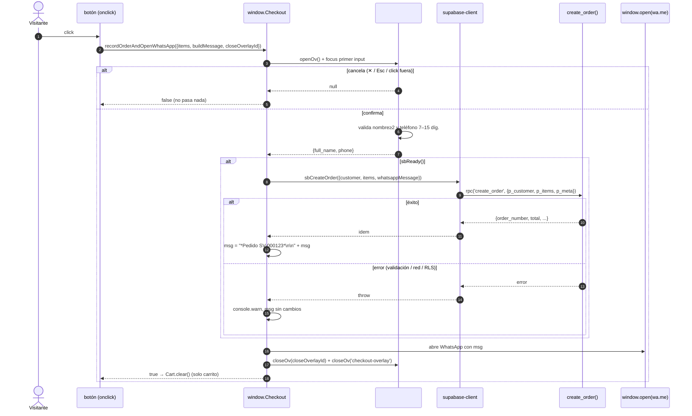

# Especificación técnica — Sticker Vault

> Documento interno. Complementa `arquitectura.md` y `modelo-de-datos.md`.

---

## 1. RPC `public.create_order(p_customer, p_items, p_meta)`

Definida en `supabase/migrations/20260905120003_functions_rls.sql`.
`LANGUAGE plpgsql`, `SECURITY DEFINER`, `SET search_path = public`.
`GRANT EXECUTE TO anon, authenticated, service_role`.

### 1.1 Entrada

#### `p_customer` — `jsonb` (objeto)
| Campo | Tipo | Obligatorio | Validación |
|---|---|---|---|
| `full_name` | string | sí | tras `trim`, longitud 2–120 |
| `phone` | string | sí | se le quitan los no-dígitos; resultado debe casar `^[0-9]{7,15}$` |
| `email` | string | no | `nullif(trim(...), '')` |
| `instagram` | string | no | idem |
| `note` | string | no | → `orders.customer_note` |

#### `p_items` — `jsonb` (array, 1–200 elementos)
Cada elemento:
| Campo | Tipo | Aplica a | Notas |
|---|---|---|---|
| `kind` | `"sticker"` \| `"pack"` \| `"pack_sorpresa"` \| `"pack_personalizado"` | todos | default `"sticker"` |
| `slug` | string | `sticker`, `pack` | debe existir en `stickers`/`packs` con `is_active=true`; si no → error |
| `quantity` | int | todos | 1–500, default 1 |
| `finish_slug` | string | `pack_*` | vinilo por defecto del pack (opcional) |
| `components` | array | `pack_*` | stickers dentro del pack |
| `components[].slug` | string | `pack_*` | si no existe se guarda igual con `name` de respaldo |
| `components[].finish_slug` | string | `pack_*` | vinilo de ese sticker (cae a `finish_slug` del pack) |
| `components[].name` | string | `pack_*` | respaldo si `slug` no resuelve |
| `components[].quantity` | int | `pack_*` | default 1 |

> Nunca se lee `price` del payload aunque venga.

#### `p_meta` — `jsonb` (objeto, opcional)
| Campo | → columna | Recorte |
|---|---|---|
| `referrer` | `orders.referrer` | 500 |
| `landing_path` | `orders.landing_path` | 300 |
| `user_agent` | `orders.user_agent` | 500 |
| `whatsapp_message` | `orders.whatsapp_message` | 4000 |

### 1.2 Algoritmo

```
1. Validar p_customer y p_items (ver arriba) → si falla, RAISE (errcode check_violation / foreign_key_violation)
2. cfg ← store_config WHERE id = 1
3. customer_id ← INSERT customers(full_name, phone, email, instagram)
                 ON CONFLICT (phone) DO UPDATE SET full_name, email(coalesce), instagram(coalesce), updated_at
4. order_id, order_number ← INSERT orders(customer_id, currency=cfg.currency, note, referrer, landing_path, user_agent)
                            -- order_number lo pone el trigger BEFORE INSERT
5. Para cada item:
     item_count += quantity
     kind = 'sticker'          → s ← stickers WHERE slug AND is_active (o error)
                                  unit = s.price ; line = unit*qty ; sticker_units += qty
                                  INSERT order_items(kind='sticker', sticker_id, snapshots de s, unit, qty, line)
     kind = 'pack'             → p ← packs WHERE slug AND is_active (o error)
                                  unit = p.price ; line = unit*qty ; extra_total += line
                                  INSERT order_items(kind='pack', pack_id, snapshots de p, unit, qty, line)
     kind = 'pack_sorpresa'|'pack_personalizado'
                              → unit = cfg.pack_price ; line = unit*qty ; extra_total += line
                                 f ← finishes WHERE slug = item.finish_slug   (opcional)
                                 oi_id ← INSERT order_items(kind, finish_id=f.id, name_snapshot='Pack Sorpresa'|'Pack Personalizado', ...)
                                 Para cada component:
                                    cs ← stickers WHERE slug            (opcional)
                                    cf ← finishes WHERE slug            (opcional)
                                    INSERT order_item_components(oi_id, cs.id, coalesce(cf.id, f.id),
                                                                 coalesce(cs.name, component.name, 'Sticker'), ...)
6. pack_count  = sticker_units / cfg.pack_size        (división entera)
   loose_count = sticker_units % cfg.pack_size
   subtotal    = sticker_units * cfg.unit_price + extra_total
   total       = pack_count*cfg.pack_price + loose_count*cfg.unit_price + extra_total
   UPDATE orders SET item_count, pack_count, loose_count, subtotal,
                     discount = greatest(subtotal-total, 0), total, whatsapp_message
7. INSERT order_events(order_id, 'created', {item_count, total}, 'anon')
8. RETURN jsonb { order_id, order_number, total, currency, whatsapp_number }
```

### 1.3 Salida (`jsonb`)
```json
{
  "order_id": "uuid",
  "order_number": "SV-000123",
  "total": 10.5,
  "currency": "PEN",
  "whatsapp_number": "51956547311"
}
```

### 1.4 Errores (todos abortan la transacción, nada se inserta)
| Mensaje | Causa |
|---|---|
| `Nombre inválido` | `full_name` fuera de 2–120 |
| `Teléfono inválido` | no quedan 7–15 dígitos |
| `El pedido no tiene ítems` | `p_items` no es array o está vacío |
| `Demasiados ítems en el pedido` | > 200 elementos |
| `Cantidad inválida` | `quantity` fuera de 1–500 |
| `Sticker no encontrado: <slug>` | slug inexistente o `is_active=false` |
| `Pack no encontrado: <slug>` | idem para packs |

En `@supabase/supabase-js` llegan como `error.message` de `.rpc()`.

### 1.5 Casos verificados (PGlite + proyecto real)
| Escenario | Resultado |
|---|---|
| 10 John Wick + 2 This Is Fine | `total 10.50`, `pack_count 1`, `loose_count 2`, `discount 1.50` |
| Pack Personalizado, 10 componentes, vinilo `blanco` | `total 8.50`, 10 filas en `order_item_components` |
| Mismo teléfono, 2 pedidos | 1 fila en `customers`, 2 en `orders` |
| Payload con `price: 0.01` | `total` real `1.00` (se ignora) |
| `anon` → `SELECT * FROM orders` | `permission denied` |
| `anon` → `UPDATE stickers SET price=0` | `permission denied` |
| `anon` → `rpc('create_order', …)` | OK (escribe vía `SECURITY DEFINER`) |

---

## 2. Loader de catálogo — `src/loaders/supabase.ts`

Exporta `productsLoader`, `categoriesLoader`, `packsLoader`, `finishesLoader`,
`pricingLoader`, usados en `src/content.config.ts`. Cada uno:

```
supabaseConfigured = Boolean(PUBLIC_SUPABASE_URL && PUBLIC_SUPABASE_ANON_KEY)
                     (import.meta.env  ??  process.env)

si NO configurado  → return file('src/content/<x>.json')   // loader nativo de Astro
si configurado     → return async () => {
                        try {
                          rows = await <query Supabase con anon key>
                          if (rows.length === 0) throw Error('0 filas')
                          return rows.map(<mapeo a la forma del JSON>)
                        } catch (e) {
                          console.warn('[supabase-loader] ⚠ ... usando JSON local')
                          return JSON.parse(readFile(process.cwd()/src/content/<x>.json))
                        }
                      }
```

- El `schema` Zod de cada colección valida venga de donde venga. `products`
  usa `category: z.string()` (no enum): las categorías válidas son las filas
  de la tabla `categories`, no una lista en el código.
- Queries: ver `modelo-de-datos.md §6`. `products` trae en paralelo
  `categories(slug)` + `stickers(..., category:categories(slug), rarity:rarities(slug), sticker_tags(tags(slug)))`
  con `.eq('is_active', true).order('sort_order')`, y **descarta con warn**
  todo sticker cuya `category` no esté en el set de categorías.
- El catálogo queda **horneado** en `dist/*.html` como bloques
  `<script type="application/json">` (`#catalog-json`, `#sprites-json`,
  `#finishes-json`, `#pricing-json`). Cambios en la BD requieren re-deploy.

---

## 3. Cliente del navegador

### 3.1 `src/scripts/supabase-client.js`
```
import { createClient } from '@supabase/supabase-js'
sb = (PUBLIC_SUPABASE_URL && PUBLIC_SUPABASE_ANON_KEY)
       ? createClient(URL, ANON, { auth: { persistSession: false } })
       : null

sbReady() → boolean
sbCreateOrder({ customer, items, whatsappMessage }) → Promise<salida RPC>
    meta = { referrer: document.referrer, landing_path: location.pathname+search,
             user_agent: navigator.userAgent, whatsapp_message }
    → sb.rpc('create_order', { p_customer: customer, p_items: items, p_meta: meta })

window.SB = { ready: sbReady, createOrder: sbCreateOrder }
```
Si no hay credenciales, `@supabase/supabase-js` se elimina del bundle por
tree-shaking y `sbReady()` es `false`.

### 3.2 `src/scripts/checkout.js` — `window.Checkout`

**Flag `RECORD_ORDERS` (arriba del archivo). Hoy: `false`.**

| `RECORD_ORDERS` | `recordOrderAndOpenWhatsApp({ items, buildMessage, closeOverlayId })` |
|---|---|
| **`false`** (actual) | `buildMessage()` → `window.open(wa.me + mensaje)` → limpia carrito. **No pide nombre/WhatsApp, no escribe en Supabase.** `@supabase/supabase-js` NO va al bundle (import dinámico dentro del `if`, eliminado por DCE). |
| `true` | 1) `collectCustomer()` (abre `#checkout-overlay`, valida nombre ≥ 2 y teléfono 7–15 díg.; `null` si cancela → aborta). 2) `import('./supabase-client.js')` → si `sbReady()`, `sbCreateOrder()` → antepone `*Pedido SV-XXXX*`. 3) si falla: `console.warn` y sigue. 4) abre WhatsApp. |

El backend (tablas, RLS, RPC `create_order`, `CheckoutOverlay.astro`) queda
igual con el flag en `false` — reactivar registro de pedidos = poner `true`.
Cierre del overlay (✕ / click fuera / Esc) = `settle(null)` = cancela.

### 3.3 Puntos de entrada
| Archivo | Función | `items` que arma |
|---|---|---|
| `cart.js` | `checkoutCart()` | `Cart.items.filter(i=>i.slug).map(i => ({ kind:'sticker', slug:i.slug, quantity:i.qty }))` |
| `mystery-pack.js` | `orderMystery()` | `[{ kind:'pack_sorpresa', quantity:1, components: mysteryPack.map(s => ({ slug:s.id })) }]` |
| `customize-pack.js` | `confirmCustom()` | `[{ kind:'pack_personalizado', quantity:1, finish_slug:selectedFinish, components: selectedIdxs.map(i => ({ slug:SPRITES[i].id, finish_slug: itemFinishes[i] })) }]` |

Cambios de soporte:
- `sv_cart_v1` → **`sv_cart_v2`** (los ítems ahora guardan `slug`).
- `catalog.js` añade `data-id="${i.id}"` a cada `.sticker-product`.
- `drop.astro` incluye `id: p.id` en el array `sprites` (`#sprites-json`).
- Carga en `BaseLayout.astro`: `analytics.js → shared.js → checkout.js → cart.js`
  (los scripts de página van después, en el slot `scripts`).

### 3.4 Vista rápida de un sticker — `#sticker-overlay` (`catalog.js`)

Al tocar una card del catálogo del home se abre `StickerOverlay.astro` y lo
llena `catalog.js` con datos de `#catalog-json` (nunca consulta Supabase):

| Función (window) | Qué hace |
|---|---|
| `openSticker(id)` | busca en `CATALOG`, llena imagen/nombre/badge/precio/tags, `openOv('sticker-overlay')`. En páginas sin `#catalog-json` es no-op. |
| `openPack(id)` | mismo overlay `#sticker-overlay` pero con datos de `#packs-json`: badge = `label`, precio `S/ 8.50 · 10 stickers`, muestra `#sv-desc` (descripción del pack), oculta `#sv-pack` y `#sv-tags`. `svCurrent.isPack = true`. Card `.pack-product` clickeable (delegación en `#packs`). |
| `renderStickerActions()` | **un solo botón**: `Agregar al carrito` (no en carrito) / `Agregar otro` (ya en carrito). Sin stepper ni link. Idéntico en desktop y móvil. |
| `svAdd()` | `Cart.add(...)`; toast con el conteo (`"… — 2 en tu carrito"`); re-render del botón. El conteo también lo muestra el badge del carrito en el header. |
| `svSearchTag(tag)` | cierra el overlay, pone `tag` en `#home-search`, `searchHomeCatalog(tag)`, scroll al catálogo. |

**Card:** toda la `<article>` (no solo la imagen) abre la vista rápida —
`role="button" tabindex="0"` + delegación de `click`/`keydown` en
`#sticker-catalog`. El `+` pasó de `.sticker-product button` a
`.sticker-product-add` (3 selectores CSS, incl. `.home-page .sticker-product
button` que dimensionaba cualquier `<button>` de la card a 23px).

**Cierre:** solo la X. `shared.js` excluye `#sticker-overlay` del cierre por
clic en el fondo (`.overlay:not(#sticker-overlay)`); Esc sí lo cierra (no se
cierra por accidente).

**Animación:** `#sticker-overlay .overlay-panel` entra desde abajo
(`translateY(52px)` → `0`, `cubic-bezier(.16,1,.3,1)`). En ≤ 560 px es un
**bottom-sheet**: `#sticker-overlay { align-items: flex-end }`, panel ancho
completo, `translateY(100%)` → `0`, esquinas superiores redondeadas.
`prefers-reduced-motion` desactiva el desplazamiento.

### 3.5 Scrollbar de los modales

`global.css` estiliza `::-webkit-scrollbar` + `scrollbar-*` (Firefox) en
`.overlay-panel`, `.cart-body` y `.cust-body`: 12 px, thumb translúcido con
`background-clip: content-box`, verde lima al hacer hover sobre el contenedor.
*(Nota: Chrome headless no pinta `::-webkit-scrollbar` — solo se ve en
navegadores reales de escritorio.)*

### 3.4 Secuencia detallada del checkout



---

## 4. Seguridad — modelo RLS

RLS **activo en las 15 tablas**. Políticas (`supabase/migrations/…_functions_rls.sql`):

### 4.1 Políticas por tabla
| Tabla(s) | Política | `USING` / `WITH CHECK` | Roles |
|---|---|---|---|
| `categories`, `stickers`, `finishes`, `packs` | `read active` (SELECT) | `is_active` | público (anon+auth) |
| `rarities`, `tags`, `sticker_tags`, `pack_items`, `store_config` | `read all` (SELECT) | `true` | público |
| todas las de catálogo (9) | `admin write` (ALL) | `is_admin()` | público (efectivo: solo authenticated admin) |
| `customers`, `orders`, `order_items`, `order_item_components`, `order_events`, `admins` | `admin only` (ALL) | `is_admin()` | público (efectivo: solo authenticated admin) |

### 4.2 Grants explícitos
- `REVOKE ALL … FROM anon` en las 6 tablas de pedidos/admin.
- `REVOKE INSERT, UPDATE, DELETE, TRUNCATE, REFERENCES, TRIGGER … FROM anon`
  en las 9 de catálogo (le queda solo `SELECT`).
- `GRANT EXECUTE ON create_order / is_admin TO anon, authenticated, service_role`.

### 4.3 Matriz efectiva

| Acción | `anon` (visitante) | `authenticated` sin admin | `authenticated` admin | `service_role` (dashboard / seed) |
|---|---|---|---|---|
| Leer catálogo activo | ✅ | ✅ | ✅ (+ inactivos) | ✅ |
| Escribir catálogo | ❌ (sin privilegio) | ❌ (RLS) | ✅ | ✅ |
| Leer `orders`/`customers` | ❌ (`permission denied`) | ❌ | ✅ | ✅ |
| Escribir `orders`/`customers` directo | ❌ | ❌ | ✅ | ✅ |
| `rpc('create_order')` | ✅ | ✅ | ✅ | ✅ |
| Insertar primer `admins` | ❌ | ❌ | ✅ | ✅ (así se hace) |

### 4.4 Por qué es seguro con el repo público
- `PUBLIC_SUPABASE_URL` + `PUBLIC_SUPABASE_ANON_KEY` son un JWT de rol `anon`
  firmado: **están pensadas para ser públicas**. Ya aparecen en el bundle de
  `dist/`.
- Un atacante con la anon key **solo** puede: leer el catálogo (público de
  todas formas) y crear pedidos vía la RPC (que valida y recalcula precios).
- No puede: leer datos de clientes, leer/alterar pedidos ajenos, cambiar
  precios, ni tocar el catálogo.
- **Nunca** al repo: `service_role` key, `SUPABASE_ACCESS_TOKEN` (token
  personal, alcance de cuenta completa), `SUPABASE_DB_PASSWORD`, JWT secret.

### 4.5 Superficie de abuso restante y mitigaciones
| Riesgo | Estado | Mitigación posible |
|---|---|---|
| Spam de pedidos basura vía la RPC | abierto | rate-limit por IP (Edge Function delante), captcha, o límite por teléfono/día en la función |
| Enumeración de `slugs` del catálogo | irrelevante (es público) | — |
| PII de clientes (nombre + teléfono) en la BD | protegida por RLS | política de retención; export cifrado; borrar `user_agent`/`referrer` si no se usan |
| `anon` puede llamar `is_admin()` | inocuo (devuelve `false`) | — |

---

## 5. Variables de entorno

| Variable | Dónde | Pública | Uso |
|---|---|---|---|
| `PUBLIC_SUPABASE_URL` | `.env`, GitHub Actions secret | **sí** (bundle) | base del proyecto: `https://<ref>.supabase.co` **sin** `/rest/v1` |
| `PUBLIC_SUPABASE_ANON_KEY` | `.env`, GitHub Actions secret | **sí** (bundle) | JWT rol `anon` |
| `SUPABASE_SERVICE_ROLE_KEY` | `.env` local | **NO** | `npm run seed` (salta RLS) |
| `SUPABASE_ACCESS_TOKEN` | `.env` local o `supabase login` | **NO** | CLI: `link`, `db push`. Alcance de cuenta completa |
| `SUPABASE_DB_PASSWORD` | `.env` local o prompt | **NO** | conexión directa a Postgres para `db push` |

`.gitignore`: `.env` y `.env.*` ignorados, `!.env.example` versionado.
`.env.example` documenta todas.

---

## 6. Operaciones

### 6.1 Aplicar cambios de esquema
```bash
# 1. crear una migración nueva
npx supabase migration new <nombre>          # crea supabase/migrations/<ts>_<nombre>.sql
# 2. editarla, luego:
npm run db:push                              # = supabase db push  (aplica al remoto linkeado)
npx supabase migration list                  # verifica local vs remoto
```
El proyecto ya está linkeado a `ctlwwuleysaiqodwxkqb`.

### 6.2 Actualizar el catálogo
```bash
# editar src/content/*.json  (fuente editable a mano)
npm run seed                                 # sube a Supabase (upsert idempotente, usa service_role)
git commit -am "catálogo: ..."  &&  git push # dispara build+deploy → hornea el catálogo nuevo
```

### 6.3 Desarrollo local con Docker (opcional)
```bash
npx supabase start                           # Postgres + Studio en :54321 / :54323
npm run db:reset                             # = supabase db reset (migraciones + supabase/seed.sql)
# .env → PUBLIC_SUPABASE_URL=http://127.0.0.1:54321, keys que imprime `supabase start`
npm run dev
```

### 6.4 Deploy
`git push` a `main` → `.github/workflows/deploy-pages.yml`:
`npm ci` → `npm run build` (con los 2 secrets PUBLIC_) → `dist/` → GitHub Pages.
Sin los secrets, el build usa `src/content/*.json`.

### 6.5 Ver / gestionar pedidos (hoy)
Supabase Dashboard → **Table Editor** → `orders`, `customers`, `order_items`,
`order_item_components`, `order_events`. Cambiar `orders.status` a mano.

### 6.6 Crear un admin
```sql
-- Authentication → Users → Add user (email + pass), luego SQL Editor:
insert into public.admins (user_id, email)
select id, email from auth.users where email = 'correo@ejemplo.com';
```
Admin actual: `hristbartra@gmail.com`.

### 6.7 Rotar secretos
`SUPABASE_ACCESS_TOKEN` → https://supabase.com/dashboard/account/tokens ·
`SUPABASE_DB_PASSWORD` → Project Settings → Database ·
`SERVICE_ROLE` / JWT → Project Settings → API (rota también la anon key).

---

## 7. Extensiones futuras (no implementadas)

| Idea | Enganche previsto |
|---|---|
| Panel de administración web | `admins` + `is_admin()` + políticas `authenticated` ya listas; falta UI + login Supabase |
| Aviso al entrar un pedido | `order_events('created')` → Database Webhook → Edge Function (email/Telegram) |
| Estados automáticos | trigger en `orders.status` → `order_events('status_changed')` + `paid_at`/`contacted_at` |
| Rate-limiting de `create_order` | contar `orders` por `customer_id`/ventana en la función, o Edge Function delante |
| Inventario | usar `pack_items` + columna de stock en `stickers`; descontar en `create_order` |
| Más medios de pago | nuevas entradas en `PAYMENT_CHANNELS` (`cart.js`) + `order_channel` enum |
| Packs con contenido fijo a la venta | poblar `pack_items`; `create_order` `kind='pack'` ya soportado |
