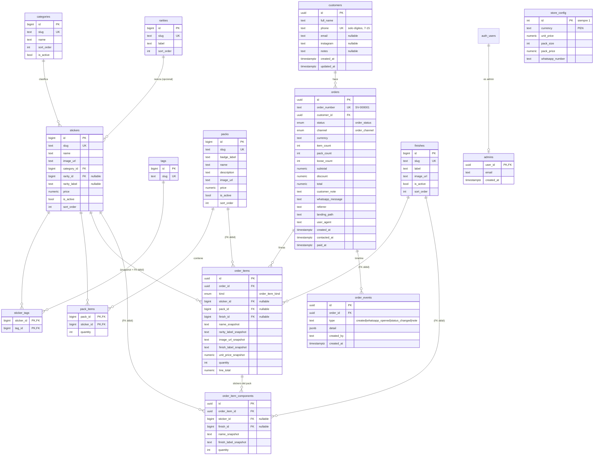

# Modelo de datos — Sticker Vault

> Documento interno. Fuente de verdad: `supabase/migrations/2026090512000{1,2,3}_*.sql`.
> Motor: PostgreSQL 15+ (Supabase). Esquema: `public`.

## 1. Diagrama entidad-relación

> **"FK débil"**: la columna referencia el catálogo por FK real (con
> `ON DELETE` por defecto = `NO ACTION`), pero el pedido **no depende** de
> que la fila del catálogo siga existiendo para tener sentido, porque toda
> la información visible está en las columnas `*_snapshot`. Si algún día se
> borra un sticker, hay que decidir entre `SET NULL` en esas FK o conservar
> el sticker con `is_active=false` (recomendado).

## 2. Enumerados

| Tipo | Valores | Uso |
|---|---|---|
| `order_status` | `pendiente` · `contactado` · `pagado` · `en_produccion` · `enviado` · `entregado` · `cancelado` | ciclo de vida del pedido; se cambia a mano (Table Editor) hasta que haya panel |
| `order_channel` | `whatsapp` | preparado para más canales |
| `order_item_kind` | `sticker` · `pack` · `pack_sorpresa` · `pack_personalizado` | qué representa la línea |

## 3. Diccionario de datos

### 3.1 Catálogo

#### `categories`
| Columna | Tipo | Reglas | Descripción |
|---|---|---|---|
| `id` | `bigint` | PK, identity | — |
| `slug` | `text` | **unique**, not null | `fortnite` · `meme` · `dev` |
| `name` | `text` | not null | Nombre visible |
| `sort_order` | `int` | default `0` | Orden en UI |
| `is_active` | `boolean` | default `true` | RLS filtra por esto para `anon` |
| `created_at` | `timestamptz` | default `now()` | — |

#### `rarities`
| Columna | Tipo | Reglas | Descripción |
|---|---|---|---|
| `id` | `bigint` | PK, identity | — |
| `slug` | `text` | **unique**, not null | `mythic` `legendary` `epic` `rare` `special` |
| `label` | `text` | not null | `Mítico`, `Legendario`, … |
| `sort_order` | `int` | default `0` | Orden (mítico primero) |

#### `stickers`
| Columna | Tipo | Reglas | Descripción |
|---|---|---|---|
| `id` | `bigint` | PK, identity | — |
| `slug` | `text` | **unique**, not null | = `id` del `products.json` (`fortnite-john-wick`) |
| `name` | `text` | not null | — |
| `image_url` | `text` | not null | URL externa o ruta `/img/...` |
| `category_id` | `bigint` | **FK → categories**, not null | — |
| `rarity_id` | `bigint` | FK → rarities, **nullable** | null en memes/dev |
| `rarity_label` | `text` | nullable | Conserva `"Meme"`/`"Dev"` cuando `rarity_id` es null |
| `price` | `numeric(10,2)` | default `1`, `>= 0` | Precio unitario suelto |
| `is_active` | `boolean` | default `true` | Oculta del catálogo público sin borrar |
| `sort_order` | `int` | default `0` | — |
| `created_at` / `updated_at` | `timestamptz` | `updated_at` por trigger | — |

Índices: `stickers_category_idx(category_id)`, `stickers_rarity_idx(rarity_id)`.

#### `tags` / `sticker_tags`
`tags(id, slug UK)` — vocabulario de búsqueda (`searchTags` del JSON).
`sticker_tags(sticker_id, tag_id)` — PK compuesta, ambas FK con
`ON DELETE CASCADE`. Relación N:N.

#### `finishes`
Vinilos del Pack Personalizado. `id`, `slug` UK (`blanco`, `arcoiris`,
`vidrio-roto`), `label`, `image_url`, `is_active`, `sort_order`.

#### `packs`
| Columna | Tipo | Reglas | Descripción |
|---|---|---|---|
| `id` | `bigint` | PK | — |
| `slug` | `text` | **unique** | `sprint-collection`, … |
| `badge_label` | `text` | nullable | El `label` del `packs.json` (`"Pack destacado"`) |
| `name` / `description` / `image_url` | `text` | `name`/`image_url` not null | — |
| `price` | `numeric(10,2)` | `>= 0` | — |
| `is_active` / `sort_order` | | | — |

#### `pack_items`
`(pack_id, sticker_id)` PK, `quantity int > 0`. Contenido fijo de un pack.
Hoy **vacío** — los packs del home son vitrinas; se usará si se venden packs
con contenido determinado.

#### `store_config` (fila única)
| Columna | Tipo | Default | Descripción |
|---|---|---|---|
| `id` | `int` | `1` (**check `id = 1`**) | Garantiza una sola fila |
| `currency` | `text` | `'PEN'` | Moneda |
| `unit_price` | `numeric(10,2)` | `1` | Precio de sticker suelto (= `pricing.json.unitPrice`) |
| `pack_size` | `int` | `10` (`> 0`) | Cuántos sueltos arman un pack |
| `pack_price` | `numeric(10,2)` | `8.50` | Precio del pack |
| `whatsapp_number` | `text` | `'51905888108'` | Número de negocio |
| `updated_at` | `timestamptz` | trigger | — |

`create_order()` lee esta fila para calcular el total. El front la recibe
embebida como `#pricing-json` (vía la colección `pricing`).

### 3.2 Clientes y pedidos

#### `customers`
| Columna | Tipo | Reglas | Descripción |
|---|---|---|---|
| `id` | `uuid` | PK, `gen_random_uuid()` | — |
| `full_name` | `text` | not null, **check** `char_length(trim())` ∈ [2, 120] | — |
| `phone` | `text` | **unique**, **check** `~ '^[0-9]{7,15}$'` | Solo dígitos (la RPC normaliza: quita `+`, espacios, `-`) |
| `email` | `text` | nullable | No se pide en el checkout actual |
| `instagram` | `text` | nullable | idem |
| `notes` | `text` | nullable | Uso interno |
| `created_at` / `updated_at` | `timestamptz` | `updated_at` por trigger | — |

**Identidad = teléfono.** `create_order()` hace `upsert on conflict (phone)`:
un cliente que vuelve no se duplica, se le actualiza el nombre.

#### `orders`
| Columna | Tipo | Reglas | Descripción |
|---|---|---|---|
| `id` | `uuid` | PK | — |
| `order_number` | `text` | **unique**, not null | `SV-000001` — lo pone el trigger `set_order_number` desde `order_number_seq` |
| `customer_id` | `uuid` | **FK → customers**, not null | — |
| `status` | `order_status` | default `pendiente` | — |
| `channel` | `order_channel` | default `whatsapp` | — |
| `currency` | `text` | default `PEN` | Copiado de `store_config` |
| `item_count` | `int` | default `0` | Suma de `quantity` de todas las líneas |
| `pack_count` | `int` | default `0` | `floor(stickers_sueltos / pack_size)` |
| `loose_count` | `int` | default `0` | `stickers_sueltos % pack_size` |
| `subtotal` | `numeric(10,2)` | default `0` | Precio a valor unitario, sin bundling |
| `discount` | `numeric(10,2)` | default `0` | `subtotal − total` (ahorro por packs) |
| `total` | `numeric(10,2)` | default `0` | **Autoritativo**, calculado en la RPC |
| `customer_note` | `text` | | Nota del cliente (`p_customer.note`) |
| `whatsapp_message` | `text` | | Texto exacto que se envió (máx. 4000) |
| `referrer` | `text` | | `document.referrer` (máx. 500) |
| `landing_path` | `text` | | `location.pathname+search` (máx. 300) |
| `user_agent` | `text` | | `navigator.userAgent` (máx. 500) |
| `created_at` / `updated_at` | `timestamptz` | `updated_at` por trigger | — |
| `contacted_at` / `paid_at` | `timestamptz` | nullable | Para llenar al gestionar |

Índices: `orders_customer_idx`, `orders_status_idx`, `orders_created_at_idx (created_at desc)`.

#### `order_items`
Una fila por línea del pedido. **Todo lo mostrable está duplicado en
`*_snapshot`** para que el pedido histórico no cambie si se toca el catálogo.

| Columna | Tipo | Reglas | Descripción |
|---|---|---|---|
| `id` | `uuid` | PK | — |
| `order_id` | `uuid` | **FK → orders `ON DELETE CASCADE`** | — |
| `kind` | `order_item_kind` | default `sticker` | — |
| `sticker_id` | `bigint` | FK, nullable | Set si `kind='sticker'` |
| `pack_id` | `bigint` | FK, nullable | Set si `kind='pack'` |
| `finish_id` | `bigint` | FK, nullable | Vinilo del pack personalizado |
| `name_snapshot` | `text` | not null | Nombre en el momento |
| `rarity_label_snapshot` | `text` | | — |
| `image_url_snapshot` | `text` | | — |
| `finish_label_snapshot` | `text` | | — |
| `unit_price_snapshot` | `numeric(10,2)` | not null | Precio unitario aplicado (de la BD, no del cliente) |
| `quantity` | `int` | **check `> 0`** | — |
| `line_total` | `numeric(10,2)` | not null | `unit_price_snapshot * quantity` |
| `created_at` | `timestamptz` | default `now()` | Orden de inserción |

Índice: `order_items_order_idx(order_id)`.

#### `order_item_components`
Los stickers concretos dentro de un `pack_sorpresa` / `pack_personalizado`.

| Columna | Tipo | Reglas | Descripción |
|---|---|---|---|
| `id` | `uuid` | PK | — |
| `order_item_id` | `uuid` | **FK → order_items `ON DELETE CASCADE`** | — |
| `sticker_id` | `bigint` | FK, nullable | — |
| `finish_id` | `bigint` | FK, nullable | Vinilo elegido para ESE sticker |
| `name_snapshot` | `text` | not null | — |
| `finish_label_snapshot` | `text` | | — |
| `quantity` | `int` | default `1`, `> 0` | Normalmente 1 |

Índice: `order_item_components_item_idx(order_item_id)`.

#### `order_events`
Timeline / auditoría. `create_order()` inserta `type='created'`. Los demás
(`whatsapp_opened`, `status_changed`, `note`) quedan para cuando haya panel
o webhooks.

| Columna | Tipo | Descripción |
|---|---|---|
| `id` | `uuid` PK | — |
| `order_id` | `uuid` FK `CASCADE` | — |
| `type` | `text` not null | evento |
| `detail` | `jsonb` default `{}` | payload libre (`{item_count, total}` en `created`) |
| `created_by` | `text` | `'anon'` o email del admin |
| `created_at` | `timestamptz` | — |

Índice: `order_events_order_idx(order_id)`.

#### `admins`
`user_id uuid PK → auth.users(id) ON DELETE CASCADE`, `email text`,
`created_at`. Habilita `is_admin()`. El primer registro se inserta a mano.

## 4. Objetos de programa

| Objeto | Tipo | Definido en | Rol |
|---|---|---|---|
| `set_updated_at()` | trigger fn | 0001 | `BEFORE UPDATE` en `stickers`, `store_config`, `customers`, `orders` |
| `set_order_number()` | trigger fn | 0002 | `BEFORE INSERT` en `orders` → `SV-` + `lpad(nextval,6,'0')` |
| `order_number_seq` | sequence | 0002 | correlativo de pedidos |
| `is_admin()` | fn `SECURITY DEFINER`, `stable` | 0003 | `exists(select 1 from admins where user_id = auth.uid())` |
| `create_order(jsonb,jsonb,jsonb)` | fn `SECURITY DEFINER` | 0003 | única escritura de pedidos para `anon` (ver `especificacion-tecnica.md`) |

## 5. Reglas de negocio embebidas en el esquema

1. **Un cliente por teléfono** (`customers.phone UNIQUE`, upsert en la RPC).
2. **Correlativo de pedido inmutable y único** (`order_number` + secuencia + trigger).
3. **El precio del cliente se ignora**: la RPC toma `stickers.price` /
   `store_config.pack_price`. `order_items.unit_price_snapshot` siempre viene
   de la BD.
4. **Bundling de sueltos**: cada `store_config.pack_size` stickers `kind='sticker'`
   se cobran a `pack_price`; el resto a `unit_price`. Igual que `cart.js`.
5. **Catálogo público solo activo**: RLS `using (is_active)` para `anon` en
   `categories`, `stickers`, `finishes`, `packs`.
6. **Borrado en cascada** de un pedido: arrastra `order_items` →
   `order_item_components` y `order_events`.
7. **Validación de entrada** replicada en dos capas: `CHECK` en `customers` +
   validación explícita en `create_order()` (nombre 2–120, teléfono 7–15
   dígitos, 1–200 ítems, `quantity` 1–500).

## 6. Cómo mapea al JSON del front

| Colección Astro | Tabla(s) | Transformación (loader) |
|---|---|---|
| `products` | `stickers` + `categories` + `rarities` + `sticker_tags`→`tags` | `{ id: slug, name, image: image_url, category: categories.slug, rarity: rarities.slug \| null, rarityLabel: rarity_label, price, searchTags: [tags.slug] }`. Descarta (warn) stickers cuya `category` no esté en `categories`. |
| `categories` | `categories` (`is_active`) | `{ id: slug, name, sortOrder: sort_order }` |
| `packs` | `packs` | `{ id: slug, label: badge_label, name, description, image: image_url, price }` |
| `finishes` | `finishes` | `{ id: slug, label, image: image_url }` |
| `pricing` | `store_config` (id=1) | `[{ id: 'default', unitPrice: unit_price, packSize: pack_size, packPrice: pack_price }]` |

El schema Zod de `products` valida `category: z.string()` (no un enum): la
lista de categorías válidas vive en la tabla `categories` / en
`src/content/categories.json`, no en el código. Agregar una categoría no
requiere tocar `content.config.ts`.

El JSON de `src/content/*.json` mantiene exactamente esa forma y sirve de
respaldo — ver `especificacion-tecnica.md §2`.
